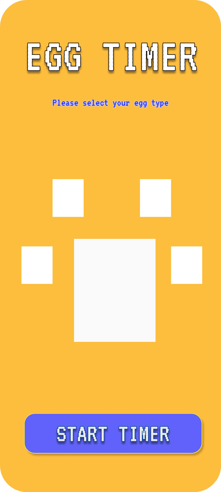

# Egg Timer

A very simple application with a user-operated countdown timer and various timer selections based on egg type.

Features:
- Fried, semi-hard boiled, soft boiled, and hard boiled timer presets
- 'Flip' button when using the Fried preset (upcoming)
- Custom timer up to 10 minutes (upcoming)
- Cute user interface (upcoming)

# Initial Design

These are the protype designs I made for the first scenes of the application. When the user opens the app,
the Egg Timer title card will display for about 3s and then slide up for the second screen. The white boxes
indicate where I will be putting in custom assets, with the four small ones being the egg types in a pixel style
and the biggest box being a timer dial in an old school timer style.

